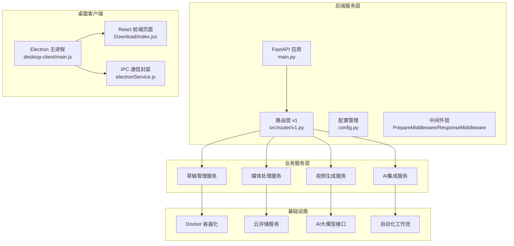
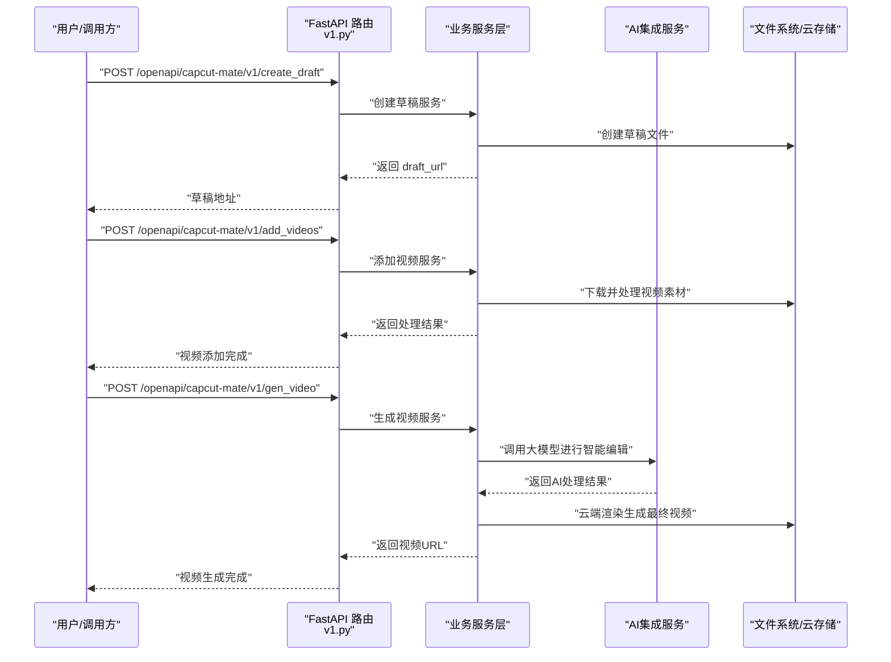

```mermaid
graph TB
subgraph "后端服务层"
A["FastAPI 应用<br/>main.py"]
B["路由层 v1<br/>src/router/v1.py"]
C["配置管理<br/>config.py"]
D["中间件层<br/>PrepareMiddleware/ResponseMiddleware"]
end
subgraph "业务服务层"
E["草稿管理服务"]
F["媒体处理服务"]
G["视频生成服务"]
H["AI集成服务"]
end
subgraph "桌面客户端"
I["Electron 主进程<br/>desktop-client/main.js"]
J["React 前端页面<br/>Download/index.jsx"]
K["IPC 通信封装<br/>electronService.js"]
end
subgraph "基础设施"
L["Docker 容器化"]
M["云存储服务"]
N["AI大模型接口"]
O["自动化工作流"]
end
A --> B
B --> E
B --> F
B --> G
B --> H
E --> L
F --> M
G --> N
H --> O
I --> J
I --> K
```

```mermaid
sequenceDiagram
participant U as "用户/调用方"
participant API as "FastAPI 路由<br/>v1.py"
participant S as "业务服务层"
participant AI as "AI集成服务"
participant FS as "文件系统/云存储"
U->>API : "POST /openapi/capcut-mate/v1/create_draft"
API->>S : "创建草稿服务"
S->>FS : "创建草稿文件"
S-->>API : "返回 draft_url"
API-->>U : "草稿地址"
U->>API : "POST /openapi/capcut-mate/v1/add_videos"
API->>S : "添加视频服务"
S->>FS : "下载并处理视频素材"
S-->>API : "返回处理结果"
API-->>U : "视频添加完成"
U->>API : "POST /openapi/capcut-mate/v1/gen_video"
API->>S : "生成视频服务"
S->>AI : "调用大模型进行智能编辑"
AI-->>S : "返回AI处理结果"
S->>FS : "云端渲染生成最终视频"
S-->>API : "返回视频URL"
API-->>U : "视频生成完成"
```
