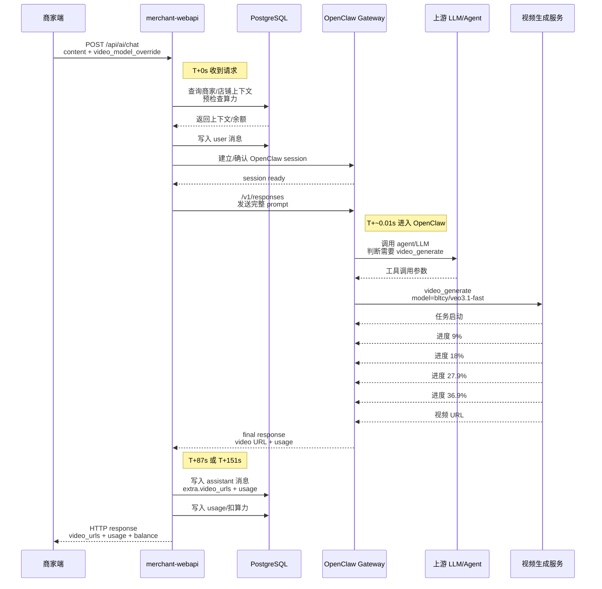

```mermaid
sequenceDiagram
    participant M as 商家端
    participant API as merchant-webapi
    participant DB as PostgreSQL
    participant OC as OpenClaw Gateway
    participant LLM as 上游 LLM/Agent
    participant V as 视频生成服务

    M->>API: POST /api/ai/chat<br/>content + video_model_override
    Note right of API: T+0s 收到请求

    API->>DB: 查询商家/店铺上下文<br/>预检查算力
    DB-->>API: 返回上下文/余额

    API->>DB: 写入 user 消息
    API->>OC: 建立/确认 OpenClaw session
    OC-->>API: session ready

    API->>OC: /v1/responses<br/>发送完整 prompt
    Note right of OC: T+~0.01s 进入 OpenClaw

    OC->>LLM: 调用 agent/LLM<br/>判断需要 video_generate
    LLM-->>OC: 工具调用参数

    OC->>V: video_generate<br/>model=bltcy/veo3.1-fast
    V-->>OC: 任务启动
    V-->>OC: 进度 9%
    V-->>OC: 进度 18%
    V-->>OC: 进度 27.9%
    V-->>OC: 进度 36.9%
    V-->>OC: 视频 URL

    OC-->>API: final response<br/>video URL + usage
    Note right of API: T+87s 或 T+151s

    API->>DB: 写入 assistant 消息<br/>extra.video_urls + usage
    API->>DB: 写入 usage/扣算力
    API-->>M: HTTP response<br/>video_urls + usage + balance

```
