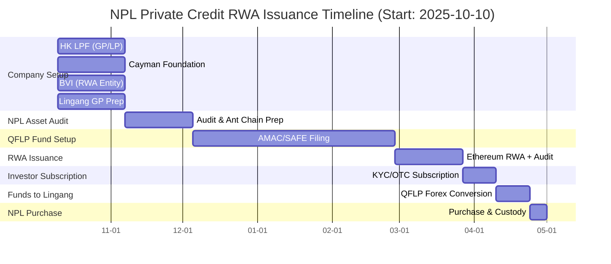

```mermaid
gantt
    title NPL Private Credit RWA Issuance Timeline (Start: 2025-10-10)
    dateFormat  YYYY-MM-DD
    axisFormat  %m-%d
    section Company Setup
    HK LPF (GP/LP)           :a1, 2025-10-10, 4w
    Cayman Foundation        :a2, 2025-10-10, 4w
    BVI (RWA Entity)         :a3, 2025-10-10, 4w
    Lingang GP Prep          :a4, 2025-10-10, 4w
    section NPL Asset Audit
    Audit & Ant Chain Prep   :a5, after a1, 4w
    section QFLP Fund Setup
    AMAC/SAFE Filing         :a6, after a1 a4 a5, 12w
    section RWA Issuance
    Ethereum RWA + Audit     :a7, after a6, 4w
    section Investor Subscription
    KYC/OTC Subscription     :a8, after a7, 2w
    section Funds to Lingang
    QFLP Forex Conversion    :a9, after a8, 2w
    section NPL Purchase
    Purchase & Custody       :a10, after a9, 1w
```

