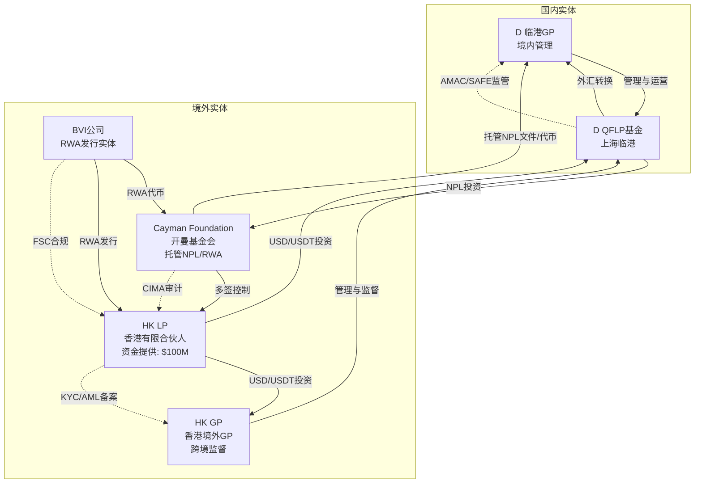

```mermaid
graph TD
    %% 主体节点
    subgraph Domestic_Entities [国内实体]
        Lingang_GP[D 临港GP<br>境内管理]
        QFLP_Fund[D QFLP基金<br>上海临港]
    end

    subgraph Foreign_Entities [境外实体]
        HK_LP[HK LP<br>香港有限合伙人<br>资金提供: $100M]
        HK_GP[HK GP<br>香港境外GP<br>跨境监督]
        Cayman_Found[Cayman Foundation<br>开曼基金会<br>托管NPL/RWA]
        BVI_Entity[BVI公司<br>RWA发行实体]
    end

    %% 资金流和关系
    HK_LP -->|USD/USDT投资| HK_GP
    HK_LP -->|USD/USDT投资| QFLP_Fund
    HK_GP -->|管理与监督| QFLP_Fund
    Lingang_GP -->|管理与运营| QFLP_Fund
    QFLP_Fund -->|外汇转换| Lingang_GP
    QFLP_Fund -->|NPL投资| Cayman_Found
    BVI_Entity -->| RWA代币| Cayman_Found
    Cayman_Found -->| 托管NPL文件/代币| Lingang_GP
    Cayman_Found -->| 多签控制| HK_LP
    BVI_Entity -->| RWA发行| HK_LP

    %% 注释
    HK_LP -.->|KYC/AML备案| HK_GP
    QFLP_Fund -.->|AMAC/SAFE监管| Lingang_GP
    Cayman_Found -.->|CIMA审计| HK_LP
    BVI_Entity -.->|FSC合规| HK_LP
```

    %% 样式（可选）
    classDef entity fill:#f9f,stroke:#333,stroke-width:2px;
    class HK_LP,HK_GP,Lingang_GP,QFLP_Fund,Cayman_Found,BVI_Entity entity;
