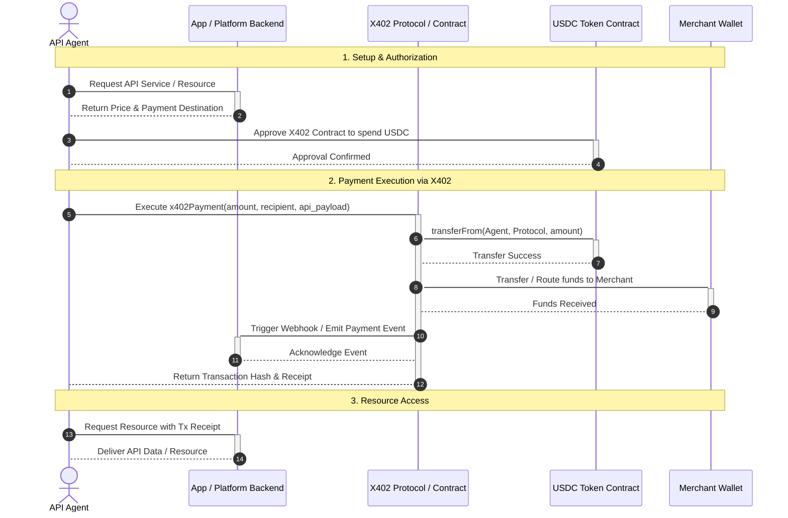

```mermaid
sequenceDiagram
    autonumber
    actor Agent as API Agent
    participant App as App / Platform Backend
    participant Protocol as X402 Protocol / Contract
    participant USDC as USDC Token Contract
    participant Merchant as Merchant Wallet

    Note over Agent, Merchant: 1. Setup & Authorization
    Agent->+App: Request API Service / Resource
    App-->-Agent: Return Price & Payment Destination
    Agent->+USDC: Approve X402 Contract to spend USDC
    USDC-->-Agent: Approval Confirmed

    Note over Agent, Merchant: 2. Payment Execution via X402
    Agent->+Protocol: Execute x402Payment(amount, recipient, api_payload)
    
    Protocol->+USDC: transferFrom(Agent, Protocol, amount)
    USDC-->-Protocol: Transfer Success
    
    Protocol->+Merchant: Transfer / Route funds to Merchant
    Merchant-->-Protocol: Funds Received
    
    Protocol->+App: Trigger Webhook / Emit Payment Event
    App-->-Protocol: Acknowledge Event
    
    Protocol-->-Agent: Return Transaction Hash & Receipt
    
    Note over Agent, Merchant: 3. Resource Access
    Agent->+App: Request Resource with Tx Receipt
    App-->-Agent: Deliver API Data / Resource
```
